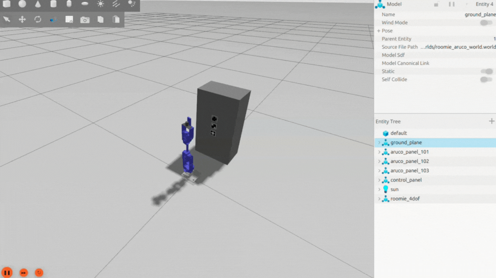
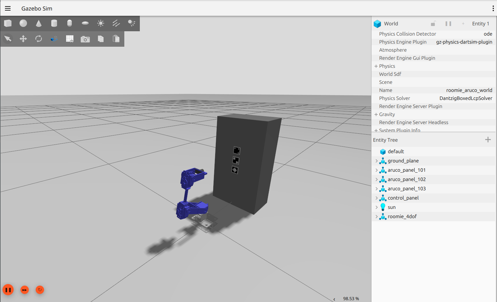
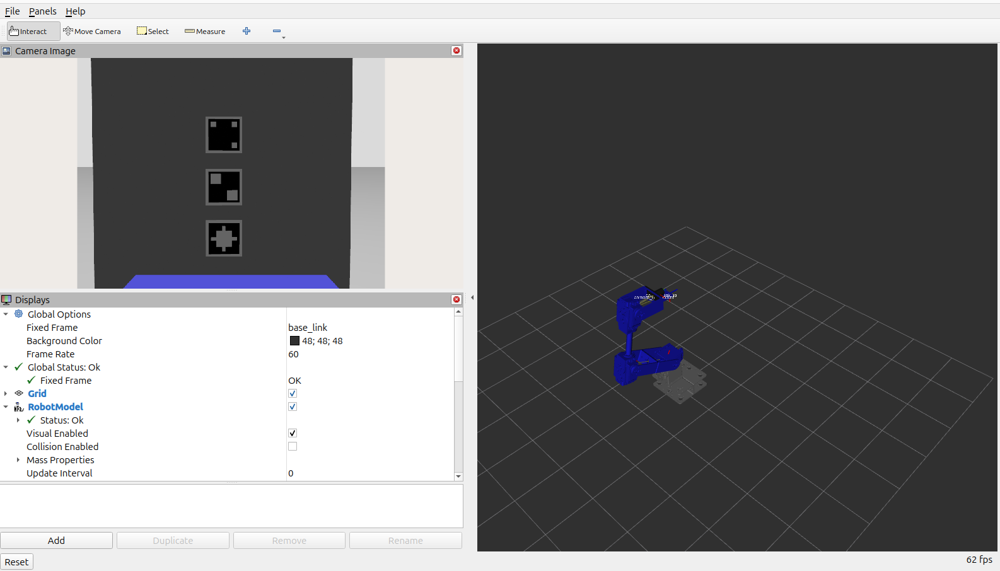
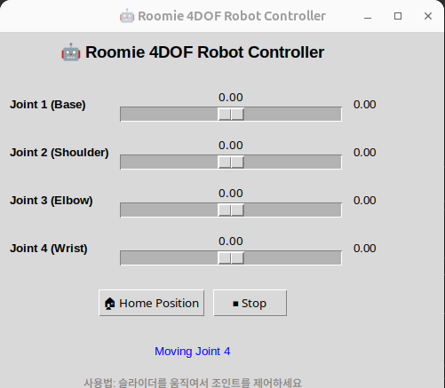

# Roomie 4DOF Robot Arm - ROS2 Gazebo Simulation

<div align="center">
    
</div>


## Features

-  **4DOF Robot Arm Simulation**: Complete physics simulation in Gazebo
-  **Integrated Camera**: Real-time camera feed with RViz visualization 
-  **ArUco Marker Detection**: Built-in support for ArUco marker environments
-  **Multiple Control Modes**: GUI sliders and programmatic control
-  **Real-time Visualization**: RViz integration with robot model and camera feed


### Prerequisites
- Python 3.12
- ubuntu 24.04
- [ROS2 Jazzy 설치](https://docs.ros.org/en/jazzy/Installation/Ubuntu-Install-Debs.html)
- [Gazebo Harmonic 설치](https://gazebosim.org/docs/harmonic/install_ubuntu/)


### Clone and Build
```bash
# Clone the repository
git clone git@github.com:jongbob1918/roomie-arm-ros2-gazebo.git
cd roomie-arm-ros2-gazebo

# Install Python dependencies
pip install -r requirements.txt

# Build the workspace
colcon build

# Source the workspace
source install/setup.bash
```

### Run the Simulation

Complete simulation with physics, robot control, and camera visualization:
```bash
ros2 launch arm_bringup simulation_control.launch.py

# Or without GUI for headless operation:
ros2 launch arm_bringup simulation_control.launch.py gui:=false
```

**What you'll see:**
- **Gazebo**: Robot arm in ArUco marker environment

<div align="center">
    
</div>

- **RViz**: Robot model, TF frames, and real-time camera feed

<div align="center">
    
</div>

- **GUI Controller**: Slider controls for each joint

<div align="center">
    
</div>

The camera feed appears automatically in RViz under "Camera Image" display.


##  Package Structure

- **arm_description**: Robot URDF, meshes, and visual configurations
- **arm_bringup**: Launch files and integration scripts
- **arm_gazebo**: Gazebo-specific configurations and worlds
- **roomie_ac**: Robot control and ArUco detection package
- **roomie_msgs**: Custom ROS2 messages


##  Manual Control
Send joint commands directly:
```bash
# Move to specific joint positions [joint1, joint2, joint3, joint4]
ros2 topic pub /forward_position_controller/commands std_msgs/msg/Float64MultiArray "data: [0.5, 0.3, -0.2, 0.1]"

# Return to home position
ros2 topic pub /forward_position_controller/commands std_msgs/msg/Float64MultiArray "data: [0.0, 0.0, 0.0, 0.0]"

# Monitor joint states
ros2 topic echo /joint_states
```

